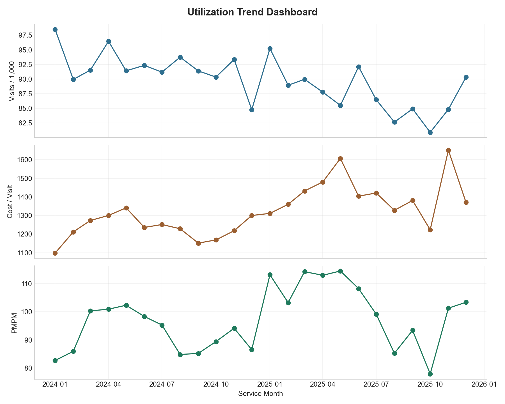

# Healthcare Claims & Reimbursement Intelligence Platform


## Executive Overview

This repository is an end-to-end healthcare claims and reimbursement analytics platform built for portfolio presentation and recruiter review. It simulates the work of a Business Information Consultant, Health System Reimbursement Analyst, or healthcare analytics team supporting payer and provider leadership.

The project converts claim-level data into executive-ready intelligence across medical cost trends, utilization, provider performance, reimbursement benchmarking, anomaly detection, forecasting, and operational recommendations. It is intentionally more complete than a basic dashboard: the pipeline generates realistic synthetic claims, calculates healthcare finance KPIs, scores provider risk, segments providers with clustering, benchmarks reimbursement against Medicare-style rates, produces presentation-quality visuals, and writes a consulting-style executive report.

## Healthcare Business Problem

Healthcare leaders need more than descriptive reporting. They need to understand:

- why paid claims and PMPM are changing
- which providers and service categories are driving cost
- whether reimbursement is aligned with benchmark expectations
- where denial rates or utilization patterns suggest operational leakage
- which claims, providers, or months warrant review
- what next-month financial exposure may look like

This platform addresses those questions with reproducible Python analytics, SQL logic, dashboard-ready CSV outputs, and executive reporting artifacts.

## Why Reimbursement Analytics Matters

Reimbursement performance directly affects medical cost management, provider contracting, revenue cycle operations, payer margin, network strategy, and executive financial planning. Benchmark variance, denial rates, utilization intensity, and PMPM movement can point to avoidable cost, coding issues, authorization breakdowns, unfavorable contracts, or emerging financial risk.

By combining claims analytics, utilization, reimbursement benchmarking, anomaly detection, provider segmentation, and forecasting, this repository demonstrates the kind of enterprise analytics workflow used by health plans, health systems, accountable care organizations, and reimbursement strategy teams.

## Workflow Architecture

```text
Raw or Synthetic Claims
        |
        v
Ingestion
src/ingest.py
        |
        v
Preprocessing and Validation
src/preprocess.py
        |
        v
Clean Claims Table
data/processed/claims_clean.csv
        |
        +--> Claims Analytics
        |    monthly cost, claim volume, denial trends
        |
        +--> Utilization Analytics
        |    PMPM, visits per 1,000, cost per visit, claims per member
        |
        +--> Reimbursement Analytics
        |    paid/billed, allowed/billed, Medicare-style benchmark variance
        |
        +--> Provider Intelligence
        |    KPI table, weighted efficiency score, risk tier, clustering
        |
        +--> Anomaly Detection
        |    z-score, IQR, benchmark, denial, PMPM, and provider risk flags
        |
        +--> Forecasting
        |    paid amount, claim volume, and PMPM forecast
        |
        v
Executive Reporting and BI Outputs
outputs/tables + outputs/figures + outputs/reports
```

See [docs/architecture.md](docs/architecture.md) for the detailed layer-by-layer architecture.

## Dataset

If `data/raw/claims.csv` does not exist, the pipeline generates a realistic 20,000-row synthetic claims dataset. The generated data includes:

- claim, member, and provider identifiers
- service date and paid date
- diagnosis and procedure codes
- service category, region, and payer
- billed amount, allowed amount, paid amount, and member responsibility
- denial flag
- member months denominator
- Medicare-style benchmark amount

The synthetic data includes injected anomalies such as high billed outpatient claims, provider denial spikes, reimbursement drops, and monthly PMPM spikes. These are included so the pipeline produces meaningful review candidates without using protected health information.

## KPI Definitions

| KPI | Definition | Business Use |
| --- | --- | --- |
| PMPM | `total paid amount / member months` | Normalizes medical cost by eligible member exposure. |
| Reimbursement rate | `paid amount / billed amount` and `allowed amount / billed amount` | Measures how submitted charges convert into allowed and paid dollars. |
| Denial rate | `denied claims / total claims` | Identifies claims payment friction and potential authorization, coding, or eligibility issues. |
| Benchmark variance | `(allowed amount - Medicare-style benchmark) / Medicare-style benchmark` | Flags providers or service lines above or below expected reimbursement levels. |
| Visits per 1,000 members | `visits / member months * 1,000` | Standard utilization metric for service intensity comparison. |
| Cost per visit | `paid amount / visits` | Shows unit cost movement across service categories. |
| Cost per member | `paid amount / unique members` | Measures cost intensity across the attributed population. |
| Provider risk score | Weighted score using cost, denial, PMPM, benchmark variance, and total paid rank | Prioritizes providers for contract, utilization, and operational review. |

## Advanced Analytics

The project includes practical, explainable analytics designed for business review:

- provider risk scoring using weighted components
- weighted provider efficiency score
- reimbursement deviation severity scoring
- high-cost provider identification
- cost driver analysis by provider, service category, and payer
- provider segmentation using KMeans clustering
- anomaly detection using z-score, IQR, and operational thresholds
- baseline forecasting using rolling average, exponential smoothing, and recent trend

These methods are intentionally transparent so a reimbursement or finance stakeholder can audit the logic before moving to more complex models.

## Anomaly Detection

The anomaly layer identifies candidates for review, not fraud determinations. It flags:

- unusually high billed claims
- high provider denial rates
- sudden monthly PMPM or paid amount breaks
- over-benchmark reimbursement patterns
- abnormal provider financial risk profiles

Each anomaly record includes entity type, entity ID, metric, severity, and rationale.

## Forecasting

The forecasting module predicts:

- monthly paid amount
- claim volume
- PMPM

The baseline forecast blends a three-month rolling average, exponential smoothing, and recent six-month slope adjustment. This creates an explainable financial planning baseline without fabricating model accuracy metrics.

## Executive Reporting

The generated executive report reads like a consulting deliverable and includes:

- latest financial performance
- paid amount and PMPM forecast commentary
- top cost drivers
- high-risk providers
- reimbursement outliers
- utilization trends
- top anomaly candidates
- operational recommendations

Report path:

```text
outputs/reports/executive_summary.md
```

## Dashboard-Ready Outputs

Core CSV outputs:

```text
outputs/tables/provider_kpis.csv
outputs/tables/monthly_trends.csv
outputs/tables/reimbursement_benchmarking.csv
outputs/tables/utilization_summary.csv
outputs/tables/cost_driver_analysis.csv
outputs/tables/anomalies.csv
outputs/tables/forecast_summary.csv
```

Additional summaries are generated by month, provider, procedure, diagnosis, region, payer, and service category.

## Project Visuals

The pipeline generates presentation-ready charts in `outputs/figures/`.

### Claims Cost Trend


### PMPM Trend


### Provider Efficiency and Risk Ranking


### Reimbursement Variance by Provider


### Utilization Trend Dashboard



Additional figure outputs include denial rate distribution, anomaly frequency by month, forecasted paid amount, forecasted claim volume, forecasted PMPM, top provider costs, and benchmark variance by service category.

## SQL Analytics Layer

The `sql/` folder mirrors core Python analytics logic and can be adapted to DuckDB, Snowflake, BigQuery, Redshift, SQL Server, or a healthcare data warehouse.

Included scripts:

- `01_claims_summary.sql`
- `02_monthly_trend_report.sql`
- `03_provider_kpi_table.sql`
- `04_reimbursement_benchmark_variance.sql`
- `05_anomaly_candidate_extraction.sql`
- `06_provider_risk_scoring.sql`
- `07_pmpm_aggregation.sql`
- `08_reimbursement_trend.sql`
- `09_denial_analysis.sql`
- `10_utilization_trend.sql`

## Sample Executive Insights

These insights are generated from the synthetic claims pipeline and will refresh when the data refreshes:

- Top providers can be ranked by total paid amount, denial rate, PMPM contribution, benchmark variance, and composite risk score.
- Provider-service-payer combinations above the 20% benchmark threshold are surfaced for contract review.
- Monthly PMPM and paid amount trend breaks are flagged for leadership review.
- High-cost providers are segmented separately from denial-risk and benchmark-variance provider groups.
- Next-month paid amount and PMPM forecasts are produced for budget monitoring.

## How to Run

Install dependencies:

```bash
pip install -r requirements.txt
```

Run the full pipeline:

```bash
python src/run_pipeline.py
```

The command will generate synthetic data if needed, clean and validate claims, build analytics tables, save figures, and write the executive summary.

## Repository Structure

```text
healthcare-claims-reimbursement-intelligence/
├── README.md
├── requirements.txt
├── data/
│   ├── raw/
│   ├── processed/
│   └── sample/
├── docs/
├── notebooks/
├── sql/
├── src/
├── outputs/
│   ├── tables/
│   ├── figures/
│   └── reports/
└── .gitignore
```

## Recruiter-Focused Resume Bullets

- Built an end-to-end healthcare claims and reimbursement intelligence platform using Python, pandas, SQL, scikit-learn, and statistical anomaly detection across 20,000 synthetic claim records.
- Developed provider-level reimbursement and financial risk scoring using paid amount, denial rate, PMPM contribution, benchmark variance, and weighted efficiency metrics.
- Created Medicare-style benchmark analytics to identify above-benchmark providers, reimbursement deviation severity, and contract review opportunities.
- Implemented provider segmentation with clustering and cost-driver analysis to prioritize operational, reimbursement, and utilization management interventions.
- Produced executive-ready CSV outputs, figures, SQL scripts, forecasts, and a consulting-style Markdown report for dashboard and leadership reporting workflows.

## Future Improvements

- Replace synthetic data with de-identified claims, eligibility, provider contract, and fee schedule extracts.
- Add member risk adjustment and product-line segmentation.
- Incorporate DRG, revenue code, place of service, modifiers, and contract terms.
- Backtest forecast accuracy before adding Prophet, ARIMA, XGBoost, or LightGBM.
- Add labeled anomaly outcomes and evaluate supervised anomaly classification.
- Build a Streamlit, Tableau, or Power BI front end on top of the generated output tables.
- Add automated data quality tests and CI checks for monthly refreshes.
