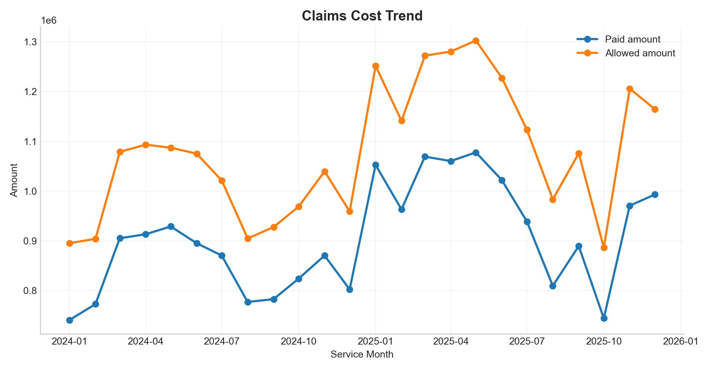
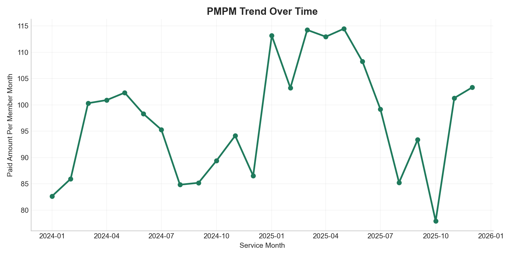
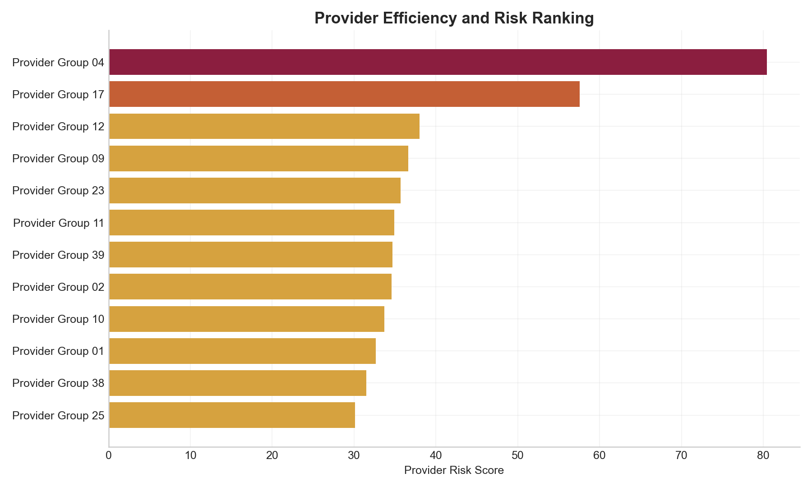
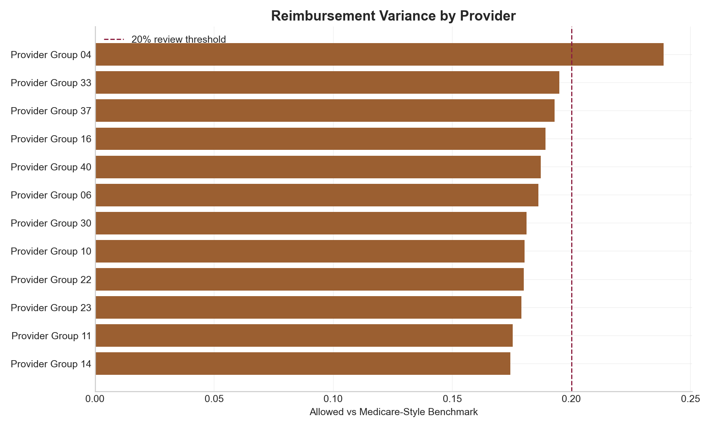
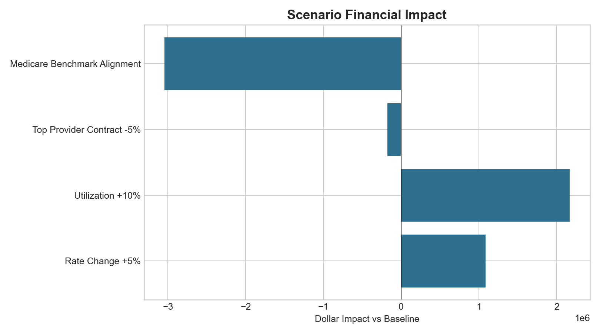
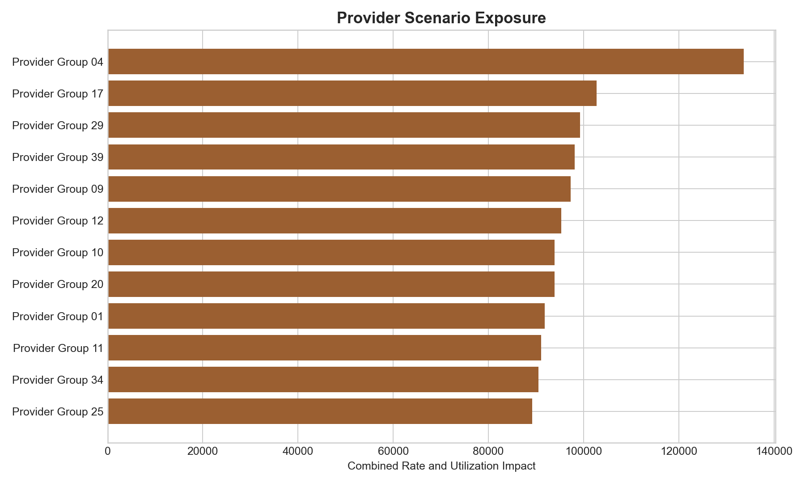
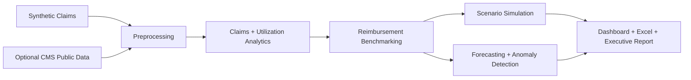

# Enterprise Healthcare Reimbursement Analytics Platform


An end-to-end healthcare reimbursement analytics platform that turns synthetic claim-level data and optional CMS Medicare public benchmarks into provider risk, PMPM, reimbursement, scenario, forecast, dashboard, and executive reporting outputs.

**What it does**

- Simulates 20K claim-level records for reimbursement analytics without using private patient-level claims.
- Calculates claims cost, denial, PMPM, utilization, reimbursement, and benchmark variance KPIs.
- Scores provider financial risk and models reimbursement, utilization, and contract change scenarios.
- Produces dashboard-ready CSVs, presentation figures, an Excel executive workbook, SQL scripts, and a Streamlit dashboard.
- Optionally integrates CMS Medicare public provider/service data for benchmark comparison.

**Tech stack:** Python, pandas, NumPy, scikit-learn, matplotlib, Streamlit, SQL, pytest, GitHub Actions, openpyxl.

## Key Features

| Capability | Business Value | Primary Outputs |
| --- | --- | --- |
| Claims Analytics | Tracks paid, allowed, billed, denial, and claim volume trends. | `monthly_trends.csv`, claims summaries |
| PMPM Modeling | Normalizes cost by member-month exposure for leadership reporting. | `monthly_trends.csv`, `utilization_summary.csv` |
| Reimbursement Benchmarking | Compares allowed and paid amounts against benchmark expectations. | `reimbursement_benchmarking.csv` |
| Scenario Simulation | Models rate, utilization, contract, and benchmark alignment changes. | `scenario_summary.csv`, scenario impact tables |
| Provider Risk Scoring | Ranks providers by cost, denial, PMPM, reimbursement, and benchmark risk. | `provider_kpis.csv` |
| Forecasting | Projects paid amount, claim volume, and PMPM with an explainable baseline. | `forecast_summary.csv`, forecast charts |
| Streamlit Dashboard | Provides interactive review for executives and analysts. | `app.py` |
| Executive Reporting | Packages insights into Markdown and Excel deliverables. | `executive_summary.md`, `executive_workbook.xlsx` |
| Optional CMS Medicare Benchmark Integration | Adds real public Medicare provider/service benchmark context when a local CMS file is supplied. | `cms_provider_service_benchmarks.csv` |

## Table of Contents

- [Quick Start](#quick-start)
- [Project Visuals](#project-visuals)
- [Business Problem](#business-problem)
- [Example Business Questions](#example-business-questions)
- [Workflow Architecture](#workflow-architecture)
- [Data and CMS Integration](#data-and-cms-integration)
- [Analytics Modules](#analytics-modules)
- [Dashboard and Executive Outputs](#dashboard-and-executive-outputs)
- [SQL Analytics Layer](#sql-analytics-layer)
- [Testing and CI](#testing-and-ci)
- [Repository Structure](#repository-structure)
- [Resume Bullets](#resume-bullets)
- [Future Improvements](#future-improvements)

## Quick Start

```bash
pip install -r requirements.txt
python src/run_pipeline.py
streamlit run app.py
```

Run tests:

```bash
pytest
```

## Project Visuals

The pipeline generates these figures in `outputs/figures/`.

### Claims Cost Trend



### PMPM Trend



### Provider Risk Ranking



### Reimbursement Variance by Provider



### Scenario Financial Impact



### Provider Scenario Exposure



Additional generated visuals include utilization trends, denial distribution, anomaly frequency, forecast charts, top provider costs, and benchmark alignment impact.

## Business Problem

Healthcare reimbursement teams need to answer cost, utilization, provider, and contract questions quickly:

- Are claims cost and PMPM moving within expectations?
- Which providers or services are driving paid amount growth?
- Are denial rates or reimbursement patterns abnormal?
- Which contract changes create the largest financial exposure?
- How should leadership prioritize provider review?

This project packages those questions into a repeatable analytics workflow for a payer/provider reimbursement analyst, business information consultant, or healthcare finance team.

## Example Business Questions

- Which providers are driving PMPM growth?
- Which service categories exceed benchmark expectations?
- What is the projected impact of a 5% reimbursement change?
- Which providers should be prioritized for contract review?
- Where are denial rates increasing abnormally?

## Workflow Architecture



The same flow is implemented in `src/run_pipeline.py`, with detailed architecture notes in [docs/architecture.md](docs/architecture.md).

## Data and CMS Integration

**Synthetic claims layer**

- Generates 20,000 simulated claim-level records when `data/raw/claims.csv` is absent.
- Includes members, providers, service dates, diagnosis/procedure codes, payer, region, billed/allowed/paid amounts, denials, member months, and benchmark amounts.
- Injects realistic anomalies so the analytics pipeline has meaningful review candidates.
- Does not use real patient-level private claims.

**Optional CMS public benchmark layer**

- Supports CMS Medicare Physician & Other Practitioners by Provider and Service public data.
- Uses a local file only: `data/raw/cms_provider_service.csv`.
- Creates procedure, state, and service benchmark metrics when the file is present.
- Falls back to simulated benchmark logic when the file is absent.

CMS public source:

https://data.cms.gov/provider-summary-by-type-of-service/medicare-physician-other-practitioners/medicare-physician-other-practitioners-by-provider-and-service

Physician Fee Schedule readiness is documented for future benchmark expansion:

- https://pfs.data.cms.gov/datasets
- https://pfs.data.cms.gov/about/api

See [docs/real_cms_data_integration.md](docs/real_cms_data_integration.md) and [docs/cms_benchmark_integration.md](docs/cms_benchmark_integration.md).

## Analytics Modules

**Core KPIs**

| KPI | Definition |
| --- | --- |
| PMPM | `total paid amount / member months` |
| Reimbursement rate | `paid amount / billed amount`; `allowed amount / billed amount` |
| Denial rate | `denied claims / total claims` |
| Benchmark variance | `(allowed amount - benchmark amount) / benchmark amount` |
| Visits per 1,000 | `visits / member months * 1,000` |
| Provider risk score | Weighted score using cost, denial, PMPM, benchmark variance, and total paid rank |

**Advanced analytics**

- Provider risk scoring and segmentation
- Cost driver analysis by provider, service category, and payer
- Reimbursement deviation severity scoring
- Anomaly detection with z-score, IQR, and business rules
- Baseline forecasting with rolling average, exponential smoothing, and recent trend

**Scenario simulation**

`src/scenario_simulation.py` models:

- `+5%` reimbursement rate change
- `+10%` utilization change
- `-5%` contract change for highest-paid providers
- benchmark alignment impact

Scenario outputs:

```text
outputs/tables/scenario_rate_change.csv
outputs/tables/scenario_utilization_change.csv
outputs/tables/scenario_provider_contract_change.csv
outputs/tables/scenario_benchmark_alignment.csv
outputs/tables/scenario_summary.csv
```

## Dashboard and Executive Outputs

**Streamlit dashboard**

```bash
streamlit run app.py
```

Dashboard views include:

- executive KPI cards
- monthly cost and PMPM trends
- provider risk ranking
- reimbursement benchmarking
- utilization trends
- scenario sliders and provider exposure tables
- anomaly review queue
- forecast summary
- embedded executive report

**Executive workbook**

```text
outputs/reports/executive_workbook.xlsx
```

Workbook tabs include Executive Summary, Provider KPIs, Monthly Trends, Reimbursement Benchmarking, Utilization Summary, Anomalies, Forecasts, Scenario Summary, Rate Change Impact, Utilization Impact, Provider Contract Impact, and Benchmark Alignment Impact.

**Dashboard-ready CSVs**

```text
outputs/tables/provider_kpis.csv
outputs/tables/monthly_trends.csv
outputs/tables/reimbursement_benchmarking.csv
outputs/tables/utilization_summary.csv
outputs/tables/cost_driver_analysis.csv
outputs/tables/anomalies.csv
outputs/tables/forecast_summary.csv
outputs/tables/scenario_summary.csv
outputs/tables/cms_provider_service_benchmarks.csv
```

The generated executive narrative is saved to `outputs/reports/executive_summary.md`.

## SQL Analytics Layer

The `sql/` folder mirrors key pipeline logic for warehouse-style reporting:

- claims summary
- monthly trend report
- provider KPI table
- reimbursement benchmark variance
- anomaly candidate extraction
- provider risk scoring
- PMPM aggregation
- reimbursement trends
- denial analysis
- utilization trends

## Testing and CI

Local checks:

```bash
python src/run_pipeline.py
pytest
```

GitHub Actions installs requirements, runs the pipeline, and executes the test suite on push and pull request events.

## Repository Structure

```text
healthcare-claims-reimbursement-intelligence/
├── app.py
├── README.md
├── requirements.txt
├── data/
│   ├── raw/
│   ├── processed/
│   └── sample/
├── docs/
├── outputs/
│   ├── figures/
│   ├── reports/
│   └── tables/
├── sql/
├── src/
└── tests/
```

## Resume Bullets

- Built an end-to-end healthcare reimbursement analytics platform using Python, SQL, Streamlit, and statistical modeling across 20K synthetic claims enriched with optional CMS Medicare benchmark data.
- Developed provider risk scoring, PMPM analytics, reimbursement benchmarking, anomaly detection, and financial impact simulation for healthcare cost and utilization analysis.
- Created executive-ready dashboards, forecasts, SQL reporting pipelines, and reimbursement scenario simulations to support payer/provider decision-making.

## Future Improvements

- Add locality, modifier, year, specialty, and facility/non-facility logic for CMS benchmark matching.
- Add member risk adjustment and product-line segmentation.
- Add DRG, revenue code, place of service, and contract term detail.
- Backtest forecasts before adding Prophet, ARIMA, XGBoost, or LightGBM.
- Add labeled anomaly outcomes for supervised review models.
